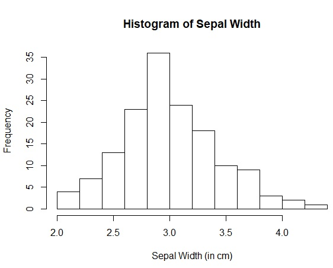

### Starting with R and RStudio

R is an upcoming statistical analysis program that is very flexible and easy to use for complex statistics. No matter if you're using R for standard statistical analysis, or if you're using R to delve into machine learning, writing and interpreting R code is a fantastic skill to have.

In order to start using R/RStudio, you will need to install it, with R being installed first. For Windows, Mac, and Linux, go to the CRAN website and [click the link to install the latest R package.](https://cloud.r-project.org/) The link highlighted will send you to your nearest server hosting an R download. Install the package and ensure it's complete installation. 

If you have another system not listed, follow the directions under **Source Code for all Platforms**.

Once this is completed, go to [the download portion](https://rstudio.com/products/rstudio/download/) of the RStudio website and download the appropriate RStudio package. Ensure it's complete installation and move on!

OK! We've made it through getting our tools. Now let's take a look at what we have.


Now that we've got a working environment to play in, let's take a look at some basic R/RStudio functions. Use CTRL+Enter to run each command.

```{r}.
?iris
?head
```

When a ? is placed in front of a command in RStudio, the help file for that command will appear in your Help console.

The help console describes the iris dataset, which is a dataset that gives the sepal length and width, and petal length and width for 50 flowers.

`?head` returns the first part of a vector, matrix, table, or dataframe. Adversely, `tail()` would return the last part.

Now, let's see what we have using our new commands:

```{r}.
flower <- iris
head(df)
```

The `<-` acts as a pointer to populate the data from `iris` to `flower`. We could use `iris`, but we want to see how we can easily assign variables in RStudio. So we'll use `flower` as the assigned vector.

Now, we'll analyze the data.

```{r}.
hist(flower$Sepal.Width, 
     main = "Histogram of Sepal Width",
     xlab = "Sepal Width (in cm)")
```

`hist` is the command to plot a histogram of `flower` based on sepal width. The `$` designates the vector that is sorting the data.

`main` determines the title of the graph, while `xlab` determines the x axis.

So, if you've done everything correctly, you should have code that resembles this:

```{r}.
# INSTALL / LOAD PACKAGES

# Load base packages manually
library(datasets)  # For example datasets

# HELP FUNCTION

?iris
?head

# LOAD / PREPARE DATA

flower <- iris
head(flower)
iris

# ANALYZE DATA

hist(flower$Sepal.Width, 
     main = "Histogram of Sepal Width",
     xlab = "Sepal Width (in cm)")
```

You should end up with a plot that looks like this:



Once you've verified your plot, run the following commands at the end of your source code to clear everything out.

```{r}.
# CLEAN UP

# Clear environment
rm(list = ls()) 

# Clear packages
detach("package:datasets", unload = TRUE)  # For base

# Clear plots
dev.off()  # But only if there IS a plot

# Clear console
cat("\014")  # ctrl+L
```

Congrats!

You've just completed your first RStudio coding!
